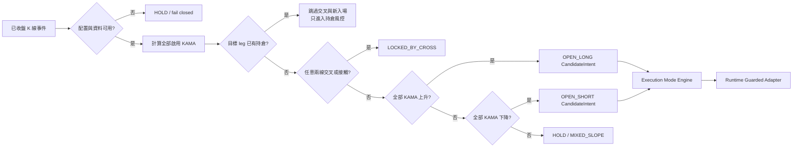

# Kama彩虹馬丁策略：完整規劃執行與投產審批報告

> **金融風險聲明：**我是 AI，不是持牌金融顧問；本報告是工程與量化分析規劃，不構成收益保證。自動交易可能造成部分或全部本金損失，任何模擬盤或實盤啟用均須由您另行明確批准並自行承擔風險。

| 文件欄位 | 內容 |
|---|---|
| 專案 | `策略容器化自動交易平台-的副本` |
| 來源策略 | 七彩虹線趨勢跟蹤階梯馬丁策略 |
| 來源 canonical key | `RAINBOW_TREND_LADDER_V1` |
| 目標策略名稱 | **Kama彩虹馬丁策略** |
| 建議目標 key | `KAMA_RAINBOW_MARTIN_V1` |
| 報告日期 | 2026-07-31 |
| 作者 | Manus AI |
| 狀態 | **已獲批准並完成生產實作與驗收；最終結果詳見完成報告** |
| 生產安全邊界 | 功能碼已完成；未建立 KRM 策略 instance、未啟用策略、未建立新常駐程序、未送出真實交易所 mutation |

> **完成報告：**請參閱 [`KAMA_RAINBOW_PRODUCTION_COMPLETION_2026-07-31.md`](./KAMA_RAINBOW_PRODUCTION_COMPLETION_2026-07-31.md)。本文件保留原始規劃、決策與驗收定義，完成報告記錄實際交付及發布證據。

## 1. 執行結論

本需求**可以在現有平台中完成**，但不能把附件內的 Python／Streamlit 範例逐字複製後直接投產。正確做法是：完整複用來源策略已驗證的產品外殼與平台安全底座，建立全新且完全隔離的策略身份，再以版本化 TypeScript canonical config、純 KAMA 計算器、同源訊號 evaluator、回測器、快照 artifact 及受保護執行管線，全面替換來源策略的七線 EMA/SMA 戰術。

| 結論 | 判定 | 原因 |
|---|---|---|
| 是否另建 Python／Streamlit 旁路系統 | **不建議** | 會繞過現有 React、tRPC、owner-scoped DB、快照、三模式、Heartbeat、guarded adapter 與部署生命週期，無法達成「全平台一致更新」 |
| 是否修改來源策略 | **禁止** | 新策略必須有獨立 key、配置鍵、狀態 namespace、回測分派、UI 與能力 manifest；來源策略行為與 UI 保持不變 |
| 是否可重用來源策略全部代碼 | **只能選擇性重用** | 可重用安全、持久化、回測帳本與 UI 結構；不可重用七線入場、趨勢反轉離場、固定 M30、來源 reason code 或 mutable state |
| 是否需要資料庫 schema migration | **初步判定不需要** | 策略配置、快照 artifact、部署能力與 position-leg state 已有 JSON／版本欄位；實作前仍須做一次最終 schema diff |
| 是否立即解鎖 S1／M2／H3 | **不得先宣稱支援** | 來源策略目前只認證 S1；新策略須完成 independent leg state、hedge guard、precise leg close 與 advanced runner 測試後才能把 M2／H3 寫入 manifest |
| 是否可直接照抄附件 KAMA 函數 | **不可** | 範例把最新 ER／SC 套用整段歷史，且新增列預設 `(10,5,3)` 的 fast／slow 次序與「最快／最慢」語義衝突 |

> **建議批准方式：**批准「最終功能涵蓋三模式、能力採證後才解鎖」的方案。也就是在同一實作計畫內完成 S1、M2、H3 所需代碼與測試，但任何未通過認證的模式在 UI 顯示阻擋原因，不得透過硬編碼或手動繞過能力註冊。

## 2. 需求映射與技術棧處置

附件九步驟應被視為**策略功能與數學需求**，而不是要求在現有平台旁邊另建第二個執行真相。下表是逐項映射後的正式處置。

| 附件要求 | 現有平台落點 | 規劃處置 |
|---|---|---|
| `main.py` 主迴圈 | 既有 Heartbeat／auto-trade signal pipeline | 不建立 daemon 或 `setInterval`；掛入既有排程與受控執行週期 |
| `kama_calculator.py` | 新的共享純函式與 server evaluator | 建立逐棒 ER／SC 的 deterministic KAMA；batch 與 streaming 必須一致 |
| `strategy_engine.py` | `shared/strategies` + `server/strategies` | 建立動態 KAMA 管理與空倉／持倉最高優先級狀態機 |
| `risk_manager.py` | strategy management + position-leg state | 實作固定間距指數馬丁、硬止損、階梯 trailing；多空對稱 |
| `fetcher.py` | exchange-aware closed-candle provider | 直接取策略所選 OKX／Bybit 的 K 線；不得讓 Bybit 策略暗中使用 OKX 資料 |
| `streamlit_app.py` | React 共用策略配置面板 | 複製來源策略 UI 架構，改為動態 KAMA 表與新風控欄位，貫通新建、編輯、回測、快照 |
| `user_config.json` | `strategies.martinState.__kamaRainbowMartinConfig` + snapshot artifact | DB／artifact 為唯一真相；UI 不直接寫本地 JSON |
| `trade_log.csv` | 既有 signal、trade、ledger、audit 資料 | DB 為真相；如需 CSV，提供匯出而非本地執行檔 |
| TradingView `<0.01` 對照 | 固定市場資料 fixture + parity test | 必須鎖定交易所、商品、時間區間、來源與 seed；不能以浮動即時資料作單元測試 |

## 3. 來源策略現況與可重用邊界

來源策略的 canonical key 已核實為 `RAINBOW_TREND_LADDER_V1`，私有配置鍵為 `__rainbowTrendLadderConfig`。其能力 manifest 目前是 `S1_ONLY`，並未認證 M2／H3。因此，「完整複製來源策略」是指複製已存在的產品入口、安全保護與整合模式，而不是把來源 key、狀態或進出場規則共用給新策略。

| 分層 | 可直接重用 | 必須新建／改寫 | 禁止沿用 |
|---|---|---|---|
| 身份與註冊 | 內建策略註冊模式、owner isolation | 新 key、名稱、logic revision、config version、release manifest | 來源 key、來源私有配置鍵、來源 runtime namespace |
| UI | 面板版型、欄位元件、安全區、錯誤摘要 | KAMA 動態表、參數說明、監控區、模式相容提示 | 固定七線、來源策略文案、來源 AI prompt |
| 配置 | normalizer／validator 的架構模式 | 全新 `KamaRainbowMartinConfig` | L1–L7 固定線、舊別名、固定 M30 |
| 訊號 | Bar-Lock、fail-closed、CandidateIntent | 動態 KAMA、交叉鎖、全升／全降 evaluator | L5 穿越、L6／L7 區間、七線排序 |
| 持倉管理 | guarded adapter、成交後才更新、KILL、owner/account guard | 上一層實際成交價錨定的馬丁、硬止損、新 trailing | 趨勢基線反轉平倉、來源 reason code |
| 回測 | 連續 Session、費用／滑點、終點會計、artifact | 同源 KAMA／entry／risk evaluator | `Max_Hold_Hours`、跨日強制平倉 |
| 快照 | 同 key 套用、checksum、round-trip、導入後 disabled | 新私有配置鍵與新 compatibility rule | 來源快照套入新策略或反向套用 |
| 三模式 | policy engine、leg ledger、preflight、flat gate | 新策略 advanced certification | 直接把來源 S1 能力複製成三模式 |

平台安全底座不屬於「多餘策略邏輯」。點差／滑點限制、報價新鮮度、交易所最小量與精度、margin budget、API 能力、owner isolation、KILL、Bar-Lock、reduce-only 平倉、reconciliation 與預設 disabled 必須保留；它們應從策略 alpha 面板移到既有部署安全區，而不是刪除。

## 4. 附件中不可直接投產的問題

| 編號 | 問題 | 直接照抄的後果 | 正式處置 |
|---|---|---|---|
| P1 | KAMA 範例只計算最新 ER／SC，再用同一 SC 回放全歷史 | 歷史 KAMA 全部被錯誤平滑，與標準逐棒算法不一致 | 每一棒重新計算 ER 與 SC，再遞迴 KAMA；建立固定向量測試[1] [2] |
| P2 | 新增 KAMA 預設 `(ER=10, fast=5, slow=3)` | 「最快」週期反而大於「最慢」語義，響應順序反轉 | 建議改為 `(10,2,30)`；若 `fast=slow` 允許作退化 EMA 測試，UI 顯示警告 |
| P3 | `previous` 初次載入為 `None` | 第一根比較會出錯或產生偽交叉 | 至少取得兩個完整已收盤 KAMA 值；不足即 `DATA_NOT_READY` 並 fail closed |
| P4 | 百分比同時使用除以 100 與乘以 100 | trailing／hard stop 閾值相差 100 倍 | canonical config 統一存「百分點」，計算入口只轉換一次 |
| P5 | `total_layers=5` 未說明是否含底倉 | 可能變成 5 層或 6 層 | 建議 L1 為底倉、最大層數 5 即最多四次加倉 |
| P6 | 「目標利潤 1.5%」未接入任何離場邏輯 | 形成無效 UI，或若當固定止盈則 1.5% 先於 3% trailing，令 trailing 永不啟動 | 建議從 V1 canonical config 刪除；如要保留，須另定義優先級與互斥規則 |
| P7 | 加倉檢查先於止損／止盈 | 同一價格可能先加大曝險再立即平倉，增加費用與損失 | 建議改為硬止損 → trailing → 馬丁加倉的 exit-first 順序 |
| P8 | 加倉後平均成本改變，但 trailing peak 如何處理未定義 | 可能立即誤觸退出或保留不可比較的峰值 | 建議每次實際加倉成交後，以新平均成本重置 trailing 狀態 |
| P9 | 每根 K 線才檢查「硬止損」 | H4／D1／W1 可延遲數小時至一週，不能稱為硬止損 | 建議 entry 只在收線；風控使用 fresh quote／mark price 的受保護風險週期 |
| P10 | `has_position` 是單一布林值 | 與 M2 的獨立多空腿及 H3 的保護腿直接衝突 | S1 使用 deployment-level；M2／H3 必須改為 leg-scoped 狀態並取得明確批准 |
| P11 | H3 預設 primary loss trigger 與硬止損同為 5% | 同一閾值下「先對沖還是先止損」會發生競態 | preflight 強制 hedge trigger 小於 hard stop，並定義唯一事件優先級 |
| P12 | 文件沒有初始 `kama_list` | 新策略無法在「至少兩條啟用線」規則下建立有效預設 | 使用者必須確認預設 KAMA 清單；不得把來源 EMA period 當作 KAMA ER 擅自轉換 |

標準 KAMA 以當期 `Change / Volatility` 求 ER，再以當期 ER 求 SC，最後執行 `Current KAMA = Prior KAMA + SC × (Price - Prior KAMA)`；ER 與 SC 是逐期變化，而非只計算一次。[1] [2]

## 5. 建議的策略身份與 canonical 契約

| 契約項 | 建議值 | 說明 |
|---|---|---|
| 顯示名稱 | `Kama彩虹馬丁策略` | 所有頁面只從 registry 讀取，不在各頁重複硬編碼 |
| strategy key | `KAMA_RAINBOW_MARTIN_V1` | 不可與來源 key 互換或就地轉換既有 instance |
| config version | `kamaRainbowMartin.v1` | 快照、回測、runtime 均驗證版本 |
| logic revision | `kama-rainbow-martin-v1` | capability artifact 與部署 preflight 綁定 |
| private config key | `__kamaRainbowMartinConfig` | 與 `__rainbowTrendLadderConfig` 完全隔離 |
| runtime namespace | `kamaRainbowMartin` | 不共用來源 mutable state |
| 新建狀態 | `enabled=false`、`activationState=DISABLED` | 新建、複製、快照導入一律不得自動啟用 |
| 來源策略保護 | key、UI、測試、快照、行為均不改 | 以 isolation regression 證明 |

建議的 canonical config 如下。初始倉位不在私有配置中重複保存，而是沿用平台 top-level deployment position contract；UI 在 USDT 模式顯示按最新價格換算的預估數量，並套用交易所最小下單量與數量精度。

| 欄位 | 型別／限制 | 建議預設 | 執行語義 |
|---|---|---|---|
| `version` | 常數 | `kamaRainbowMartin.v1` | 禁止未知版本靜默降級 |
| `timeframe` | `M5/M15/M30/H1/H4/D1/W1` | `M30` | 只驅動該策略的 entry bar 與 KAMA closes |
| `kamaLines` | 2–32 條啟用線 | **待確認** | 保留順序、stable id、名稱、ER、fast、slow、顏色 |
| `kamaLines[].id` | immutable string | 建立時生成 | 快照與 UI row identity；改名不改 id |
| `kamaLines[].enabled` | boolean | true | disabled 線完全不參與 KAMA、交叉與方向 |
| `kamaLines[].name` | 1–40 字、顯示上唯一 | 待確認 | 只影響顯示與 reason context |
| `kamaLines[].erPeriod` | 整數 2–500 | 建議 10／20 起始 | 每棒 ER lookback |
| `kamaLines[].fastEma` | 整數 1–500 | 建議 2 | `fast <= slow`；相等時是退化 EMA 並警告 |
| `kamaLines[].slowEma` | 整數 1–500 | 建議 30 | 不接受 `fast > slow` |
| `kamaLines[].color` | `#RRGGBB` | 待確認 | 僅 UI／圖表，不影響 evaluator |
| `maxLayers` | 整數 1–20 | 5 | 建議包含底倉 L1 |
| `multiplier` | `>=1`，有理上限 | 2.0 | L1=初始量；Ln=`initial × multiplier^(n-1)` |
| `gapPct` | `>0` 百分點 | 2.0 | 相對上一層實際成交價；多空對稱 |
| `hardStopLossPct` | `>0` 百分點 | 5.0 | 相對當前加權平均成本；不可寫死 |
| `trailing.enabled` | boolean | true | false 時不更新 trailing peak／trigger |
| `trailing.activationPct` | `>0` 百分點 | 3.0 | 浮盈達標後啟動 |
| `trailing.callbackPct` | `>0` 百分點 | 1.5 | 啟動時首條線為 `activation - callback` |
| `trailing.stepPct` | `>0` 百分點 | 0.5 | 峰值每完整增加一步，trigger 上移一步 |
| `targetProfitPct` | 暫不納入 | 刪除建議 | 附件沒有可執行語義，須由使用者決定 |

32 條上限是平台效能與濫用防護，不是 alpha 限制。因任意兩線交叉需要 `O(n²)` 比較，32 條共有 496 對，仍可在每個收線事件中確定性完成；若未來要再提高，應先做 benchmark，而不是無界接受。

## 6. KAMA 數學與市場資料契約

### 6.1 唯一 KAMA 算法

正式實作只保留一個純函式／streaming accumulator，所有策略頁、回測、paper、live 與監控均調用它。建議規則是：先驗證有限 close；每一棒以 `erPeriod` 計算 change 與 volatility；零波動時 ER=0；每棒計算 `fastSC=2/(fast+1)`、`slowSC=2/(slow+1)` 及 `SC=(ER×(fastSC-slowSC)+slowSC)^2`；初始 KAMA 使用固定 seed 政策；未 ready 的輸出為 `null`，禁止回退為最新價。[1] [2]

| 數學決策 | 建議規則 | 測試要求 |
|---|---|---|
| seed | 建議 `SMA(first erPeriod closes)` | 固定 reference vector；任何變更提升 logic revision |
| warm-up | 至少取得足以產生兩個 ready KAMA 值的 closes，另加穩定 warm-up buffer | 不足資料返回 `DATA_NOT_READY`，不得假裝等於現價 |
| zero volatility | ER=0 | flat series 不產生 NaN／Infinity |
| `fast=slow` | 數學允許、UI 警告退化為固定 EMA | 專門覆蓋附件要求的 KAMA(2,2,2) 測試 |
| `fast>slow` | 拒絕 | 防止附件 `(10,5,3)` 的語義反轉 |
| batch／streaming | 同一 closes、同一 config 必須逐點相等 | property test + 固定向量 |
| line consistency | 所有啟用線使用同一 exchange、symbol、timeframe、closed closes | artifact 記錄資料身份與最後收線時間 |

TradingView `<0.01` 驗證不能只寫「M30」。測試 fixture 必須固定 `exchange + instrument + source(close) + bar timestamps + timezone + seed policy + exact closes`；否則不同交易所的 BTC 價格本身就不相同。建議將 TradingView 匯出的固定 closes 納入測試資料，KAMA(2,2,2) 只作 parity fixture，不作唯一的正確性證據。

### 6.2 Exchange-aware closed-candle provider

OKX 官方 candles API 支援 `5m/15m/30m/1H/4H/1D/1W`，並用 `confirm=1` 表示已完成 K 線；`confirm=0` 不得進入 KAMA。[3] Bybit V5 Kline 支援 `5/15/30/60/240/D/W`，且未完成 K 線的 close 是當下最後成交價，因此 provider 必須按 bar 起始時間與目前交易所時間排除當前未收線項。[4]

| UI timeframe | OKX `bar` | Bybit `interval` |
|---|---:|---:|
| M5 | `5m` | `5` |
| M15 | `15m` | `15` |
| M30 | `30m` | `30` |
| H1 | `1H` | `60` |
| H4 | `4H` | `240` |
| D1 | `1D` | `D` |
| W1 | `1W` | `W` |

Provider 輸出必須統一為時間正序、timestamp 去重、OHLC 有限、已收線、同一商品與同一交易所；同時回傳 `exchange`、`symbol`、`timeframe`、`lastClosedBarTimestamp` 與資料 checksum。現行「adapter 參數存在但固定讀 OKX 公開 candles」的行為不能複製到新策略。

## 7. 入場 evaluator：完整狀態契約

每個 closed-bar event 先載入經驗證的 active config revision，再取得同一 closes，批次計算所有啟用 KAMA 的 previous／current。任何配置錯誤、資料不足、未收線、非有限值、provider mismatch 或 config revision 競態都必須 fail closed。

交叉判斷不直接使用布林 `>` 的異或，因為相等與浮點噪聲未定義。建議對每一對 KAMA 計算 previous delta 與 current delta；若符號翻轉，回傳 `CROSS_LOCK`；若任一 delta 在相對 epsilon 內接近零，回傳更保守的 `TOUCH_LOCK`。任何一條線不升不降，都不得被算入 all-up／all-down。

| reason code | 語義 | 是否允許增加曝險 |
|---|---|---|
| `KRM_CONFIG_INVALID` | canonical config 驗證失敗 | 否 |
| `KRM_DATA_NOT_READY` | 不足兩個 ready KAMA 值 | 否 |
| `KRM_CANDLE_UNCLOSED` | provider 含未收線 bar | 否 |
| `KRM_CROSS_LOCK` | 任意線對相對順序反轉 | 否 |
| `KRM_TOUCH_LOCK` | 任意線對接觸／近似相等 | 否 |
| `KRM_MIXED_SLOPE` | 不是全升，也不是全降 | 否 |
| `KRM_ALL_UP` | 所有啟用 KAMA 上升且無交叉 | 產生 long candidate，仍須 mode／risk guard |
| `KRM_ALL_DOWN` | 所有啟用 KAMA 下降且無交叉 | 產生 short candidate，仍須 mode／risk guard |
| `KRM_POSITION_MANAGEMENT` | 目標 leg 已持倉，KAMA 不參與該腿管理 | 否；只准持倉風控 action |
| `KRM_BAR_ALREADY_PROCESSED` | 同 deployment／config revision／bar 已處理 | 否 |

## 8. 持倉管理、馬丁與離場

每個 position leg 需要獨立保存 `currentLayer`、`baseFillPrice`、`lastLayerFillPrice`、`averageCost`、`totalQuantity`、每層實際 fill、`trailingActive`、`peakProfitPct`、`triggerProfitPct`、`configRevisionAtOpen` 與最後處理事件。狀態只能在交易所確認成交後更新；委託失敗、拒單或未成交不得先行增加層數。

| 規則 | 多單 | 空單 |
|---|---|---|
| 下一層觸發 | `price <= lastFill × (1-gapPct/100)` | `price >= lastFill × (1+gapPct/100)` |
| 第 n 層目標量 | `initial × multiplier^(n-1)` | 同式 |
| 平均成本 | `sum(fillPrice×fillQty)/sum(fillQty)` | 同式 |
| 浮盈百分點 | `(price-avgCost)/avgCost×100` | `(avgCost-price)/avgCost×100` |
| 硬止損 | `profitPct <= -hardStopLossPct` | 同式 |
| trailing 啟動 | `profitPct >= activationPct` | 同式 |
| trailing 平倉 | `profitPct <= triggerProfitPct` | 同式 |

建議的 trailing 唯一公式為：`steps=floor(max(0, peak-activation)/step)`，`trigger=activation-callback+steps×step`。每次新高只更新 peak；每次實際加倉改變平均成本後，重置 trailing，再從新平均成本重新啟動。`trailing.enabled=false` 時不更新任何 trailing 狀態，但硬止損仍存在。

附件的 pseudocode 先加倉再檢查退出，這在同一價格同時滿足 gap 與 hard stop 時會放大風險。正式建議採用以下優先級：平台 KILL／reconciliation close-only → 硬止損 → trailing exit → 馬丁加倉 → HOLD。此處是**需要您批准的安全修正**，不是無意間更改文件。

為避免價格跳空一次跨越多層而連續下單，單一風險事件最多批准一個新層；只有該層實際成交並更新 `lastLayerFillPrice` 後，下一個新事件才可評估下一層。所有數量先經交易所 min quantity、step size、available margin 與 deployment risk budget 正規化。

## 9. 「持倉豁免交叉」的精確定義

> **核心不變條款：**對任何已存在的 position leg，KAMA 交叉不得觸發該腿平倉、不得阻止該腿的馬丁、不得重置 trailing、不得改變 hard stop，也不得把該腿反轉。

S1 可直接把 `has_position` 解讀為整個 deployment 是否已有唯一 leg；但 M2／H3 必須採 leg-scoped 解讀，否則它們在邏輯上沒有可用入口。這是附件單一布林模型與三模式需求之間最重要的語義衝突。

| 模式 | 建議正式語義 | 與附件的關係 |
|---|---|---|
| S1 `SINGLE_EXCLUSIVE` | 有任何 leg 時只管理該 leg；flat 時才判斷新入場 | 完全符合附件 |
| M2 `MULTI_POSITION` | 已存在 LONG 的管理忽略 KAMA；若 SHORT leg 為空，新的 all-down candidate 可建立獨立 SHORT。反向亦同；每側最多一腿 | 把「有持倉」收斂為「該 target side 已有持倉」，需使用者批准 |
| H3 `HEDGE_GUARDED` | 主腿管理仍忽略 KAMA；只有主腿浮虧達較低 hedge trigger 且出現反向 candidate 時，mode engine 才可建立受限保護腿 | H3 對反向 KAMA 的使用是平台級保護例外，不是用 KAMA 關閉主腿；需使用者批准 |

若您堅持「帳戶只要有任何持倉，所有 KAMA 一律完全不再計算或使用」，則新策略只能合法認證 S1，M2／H3 必須顯示不相容；系統不能同時宣稱三模式可用。

## 10. 三模式能力、preflight 與生命週期

新 release 初始 manifest 應為 `S1_ONLY`。只有在 advanced 測試完整通過後，才可把 manifest 改為 `CERTIFIED` 並宣告 `supportedModes=[SINGLE_EXCLUSIVE,MULTI_POSITION,HEDGE_GUARDED]`、`martingaleLayers=true`、`independentLegState=true`、`hedgeGuard=true`、`preciseLegClose=true`。

| 驗證面 | S1 | M2 | H3 |
|---|---|---|---|
| 最大開放 legs | 1 | 2，每方向最多一腿 | 1 primary + 1 hedge |
| 馬丁狀態 | 單腿 | 每腿完全隔離 | primary／hedge 隔離；建議 hedge martingale 預設關閉 |
| 平倉 | 唯一腿 reduce-only | 必須精準指定 LONG 或 SHORT leg | 精準指定 primary／hedge，不得 `close all` 代替 |
| 相反訊號 | `CLOSE_THEN_WAIT` 不由 KAMA 直接反轉 | 可開缺少的獨立 opposite leg | 只在 loss trigger、cooldown、ratio、opposite signal 全部通過時建 hedge |
| 模式切換 | flat gate | flat gate | flat／drained 且無 active hedge relationship |
| 交易所能力 | 基本 reduce-only | long/short independent + positionSide | hedge mode + precise leg close + capability fresh |

H3 必須增加跨欄位 preflight：`primaryLossTriggerPct < hardStopLossPct`，並保留安全緩衝。若 hard stop 預設 5%，建議 hedge trigger 不高於 4%；在到達 -5% 時仍執行 hard stop，不因已建立 hedge 而取消主腿止損。若使用者選擇其他 unwind policy，必須另行版本化。

所有部署仍遵循 `DRAFT/DISABLED → PREFLIGHT → READY_DISABLED → ARMED → ACTIVE`。新建、更新、快照導入、config revision 變更、logic revision 變更或 capability 過期，都會令舊 preflight 失效；不允許以 UI 隱藏按鈕代替後端阻擋。

## 11. UI 與全平台功能更新

新策略 UI 應複製 `RainbowTrendLadderConfigPanel` 的成熟結構與視覺層級，但建立全新 `KamaRainbowMartinConfigPanel`，避免任何 props、state 或私有配置鍵回寫來源策略。相同面板必須被策略新建／編輯、回測、快照詳情與快照導入共同使用。

| 功能面 | 新增／更新內容 | 驗收重點 |
|---|---|---|
| 策略交易－新建 | 新策略卡片、M30 預設、初始倉位、動態 KAMA 表、馬丁、trailing、hard stop | 保存後 key 正確、預設 disabled、所有錯誤可定位到欄位 |
| 策略交易－編輯 | 同一 canonical panel、active／pending revision 提示 | 不允許把來源策略 instance 改 key；持倉中變更需遵循 config pinning 決策 |
| KAMA 管理表 | enabled、name、ER、fast、slow、color；新增、選取刪除、拖曳排序 | 至少兩條啟用線；stable id；`fast>slow` 阻擋；新增預設修正為 `(10,2,30)` |
| 監控面板 | 每線 current／previous／箭頭、交叉 pair、入場權限、資料時間、持倉方向、layer、avg cost、trailing、今日盈虧 | 唯讀；顯示 stale／not ready；今日盈虧按使用者本地日界線展示，資料仍存 UTC |
| 回測中心 | 新 key 分派、同一 KAMA panel、終點會計設定、費用／滑點、資料身份 | 不出現已刪除的跨日／最大持倉退出；回測與 live reason code 同源 |
| 參數快照庫 | 顯示 KAMA 列表、時間週期、風控、版本、checksum、相容性 | 可自訂快照名稱；來源快照與新策略互相拒絕 |
| 從快照導入 | 預填新策略 panel，重新 normalize／validate | 建立全新 disabled instance；不得帶入 armed／active／runtime state |
| 策略工作室 | 內建策略註冊、分類、能力徽章、logic revision | S1／M2／H3 只根據 manifest 顯示，不能靠名稱猜測 |
| 三模式部署工作台 | 不另複製整頁；讓現有模式選擇器讀新 manifest | 未認證顯示明確 blocker；mode switch 保持 flat gate |
| Dashboard／訊號與交易日誌 | 新策略名稱、reason code、candidate、decision、fill、PnL | disabled 策略不產生訊號／錯誤噪聲；手動與自動 intent 都經同一 guarded path |
| 安全與 KILL | 複製來源安全控制的能力，但改新 namespace 與文案 | KILL／close-only 不受 KAMA 或 UI 配置影響；平倉必須可驗證到交易所成交 |

來源策略的 AI 參數研究面板與 router 預設**不複製**。它的 prompt、schema 與建議都綁定固定七線 V1，附件亦未要求；若保留會違反「多餘的東西全刪除」。

## 12. 配置更新與持倉中熱切換

附件要求 UI 變更在下一根所選週期 K 線生效，但沒有定義持倉中改變 gap、multiplier、hard stop 或 timeframe 的結果。為可重現與降低誤操作，建議採 `draftConfigRevision` 與 `activeLegConfigRevision` 雙層規則。

| 場景 | 建議行為 |
|---|---|
| flat、UI 保存 | 新 revision 在下一根該 timeframe 的 closed bar 原子生效 |
| 已有 position leg、改 KAMA／timeframe | 不影響該腿管理；只影響下一個可開的新腿 |
| 已有 position leg、改馬丁／trailing／hard stop | 建議該腿沿用開倉時 revision，直到 flat；UI 顯示「待下次新腿生效」 |
| KILL／平台風險收緊 | 立即生效，不受 config pinning 限制 |
| 快照套用 | 產生新 revision、部署停用、preflight 失效；不得熱替換 active leg |

若您要求持倉中的風控參數立即熱更新，必須另做雙重確認、變更前後差異預覽、audit event 與「可能立即加倉／平倉」警告；不建議把這種高風險行為設為預設。

## 13. 回測、快照與實盤一致性

回測不能另寫一套近似公式。KAMA、cross/touch、slope、martingale quantity、average cost、hard stop、trailing 及 reason code 都應來自與 runtime 同一組純函式；回測器只負責時間推進、OHLC 觸發、費用、滑點、資金與報表。

| 一致性契約 | 規則 |
|---|---|
| 資料 | 同 exchange／symbol／timeframe；只用已收盤 K 線；排序、去重、品質摘要 |
| config | artifact 內保存 canonical config、config version、logic revision、checksum |
| intra-bar | 若 risk 用即時價，回測須明確定義 OHLC 路徑或採保守事件順序，避免同一 bar 的先後看未來 |
| fees/slippage | 所有 entry、add、exit 均計入；不得只對底倉計費 |
| position at end | 保留 `mark_to_market`／`force_close` 作回測會計選項，但不把它當實盤策略退出條件 |
| snapshot round-trip | `normalize(serialize(config))` 等價；line id／順序／顏色完整保留 |
| compatibility | strategy key、config version、logic revision、mode capabilities 不符即阻擋 |
| import safety | 只導入配置，不導入持倉、layer、trailing peak、armed、active 或 API/account state |

「100 根 K 線刻意製造交叉」應建立 deterministic fixture：空倉交叉必須鎖定；持多或持空期間相同交叉不得產生 close／reverse，也不得阻止已符合條件的馬丁；真正離場只可由 hard stop、trailing、KILL 或明確 reconciliation 產生。

## 14. 檔案級實作清單

下列清單是預計實作面，不代表目前已修改。若實際程式結構在開發時出現可消除的重複，優先抽取純共用函式，但不得把來源策略 mutable state 抽成共享。

| 動作 | 檔案／模組 | 內容 |
|---|---|---|
| 新增 | `shared/strategies/kamaRainbowMartin.ts` | key、version、型別、defaults、normalizer、validator、derive、reason contracts |
| 新增 | `server/strategies/kamaRainbowMartin/core.ts` | 逐棒 KAMA、dynamic manager、cross/touch、all-up/all-down、CandidateIntent |
| 新增 | `server/strategies/kamaRainbowMartin/management.ts` | per-leg martingale、avg cost、hard stop、trailing、fill application、reset |
| 新增 | `server/strategies/builtin/strategyKamaRainbowMartin.ts` | 內建策略橋接與新 namespace |
| 新增 | `server/services/exchangeClosedCandleProvider.ts` | OKX／Bybit timeframe mapping、closed-bar filtering、data identity |
| 新增 | `server/services/backtest/kamaRainbowMartinBacktest.ts` | 同源 evaluator 的策略回測 runner |
| 新增 | `client/src/components/KamaRainbowMartinConfigPanel.tsx` | 動態 KAMA 與風控共用面板 |
| 新增 | `client/src/components/KamaRainbowMartinSafetyControls.tsx` | 新策略專用安全狀態、KILL／close-only UI |
| 修改 | `server/routers.ts` | create／update input、私有配置鍵、正規化、衍生欄位、禁止 key mutation |
| 修改 | `server/routers/backtest.router.ts` | apply snapshot、import as new、相容性與 disabled gate |
| 修改 | `server/services/autoTradeSignalGenerator.ts` | 新 key 分派、exchange-aware candles、closed-bar evaluator、position-first branch |
| 修改 | `server/services/executor.ts` | 新策略 protected execution、fill-driven state、precise leg close |
| 修改 | `server/services/backtest/backtestEngine.ts` | 新 key runner 分派 |
| 修改 | `server/services/strategySnapshotConfig.ts` | `__kamaRainbowMartinConfig` 映射與 round-trip |
| 修改 | `server/services/strategyStudio.ts` | 內建註冊、名稱、分類、mode capability 顯示 |
| 修改 | `server/services/strategyCapabilityRegistry.ts` | S1 初始 release；advanced 證據通過後升級 manifest |
| 修改 | `server/services/martingaleCapability.ts` | 新策略的層數能力與風險聲明 |
| 修改 | `client/src/pages/Strategies.tsx` | 新建／編輯／提交／卡片／快照預填分派 |
| 修改 | `client/src/pages/Backtest.tsx` | 新策略 panel、回測 payload 與結果顯示 |
| 修改 | `client/src/pages/ParameterSnapshots.tsx` | 詳情、相容性、導入與自訂名稱 |
| 新增 | `server/kama-rainbow-martin-*.test.ts` | config、math、core、management、backtest、snapshot、isolation、modes |
| 不改 | `shared/strategies/rainbowTrendLadder.ts` 及來源專用檔案 | 只以 regression 測試證明來源策略不受影響 |
| 原則不改 | `drizzle/schema.ts` | 現有 JSON／artifact／position-leg 欄位足夠；若 final diff 發現不足，先停下另報 migration |
| 不新增 | 獨立 Python daemon、Streamlit、local JSON／CSV 真相、旁路 `setInterval` | 避免 Autoscale／Heartbeat／安全邊界衝突 |

## 15. 完整測試與驗收矩陣

| 測試層 | 必測案例 | 通過標準 |
|---|---|---|
| Identity／isolation | 新舊 key、私有配置鍵、runtime namespace、deep clone | 修改新策略不改來源策略任何配置、UI、回測與行為 |
| Config | dynamic add/delete/enable/reorder、min 2、max 32、stable id、版本、百分點 | 非法配置逐欄阻擋；序列化 round-trip 無損 |
| KAMA math | 逐棒 ER／SC、flat、短資料、NaN、fast=slow、fast>slow、batch=stream | 固定 reference vector 相符；不以被測函式本身生成 expected |
| TradingView parity | 固定 M30 closes 上 KAMA(2,2,2) | 同一輸入、seed 與 source 下絕對誤差 `<0.01`；fixture 可重現 |
| Entry | 任意線對交叉、touch、全升、全降、混合、first-ready、same-bar replay | 只產生預期 reason code；同 bar 不重複 candidate |
| Position exemption | 多／空持倉期間製造 KAMA 交叉 | 不 close、不 reverse、不阻止合法 martingale／risk action |
| Martingale | 多空對稱、上一層 fill 錨、指數量、max layer、gap jump、partial fill、reject | 一事件最多一層；失敗委託不前移 state；平均成本精確 |
| Exit | hard stop、trailing enable／disable、step ratchet、加倉後 reset、同事件衝突 | 唯一優先級；完整腿 reduce-only 平倉；多空鏡像 |
| Backtest | 100+ bars、交叉 fixture、費用滑點、終點政策、continuity | 與純 evaluator reason/action 一致，帳本可對平 |
| CRUD／owner | create、edit、readback、user isolation、key mutation | 新建與導入 disabled；不能讀寫其他 owner；不能改 key |
| Snapshot | save custom name、apply、wrong key、import new、old source snapshot | 不相容即 fail closed；不導入 runtime／armed state |
| Market data | OKX／Bybit、7 timeframe、unclosed filter、sort/dedupe/stale | 策略選哪個 exchange 就用哪個 exchange；只處理 closed bar[3] [4] |
| S1 | single leg、opposite candidate、flat gate、close | 不超過一腿；position-first 不受 KAMA 交叉影響 |
| M2 | long/short independent、per-leg martin/trailing、precise close | 一側操作不改另一側 state；最多每側一腿 |
| H3 | loss trigger、opposite signal、ratio、cooldown、hard-stop conflict、unwind | 未滿全部 guard 不開 hedge；可精準關指定腿；trigger 小於 hard stop |
| Runtime guard | stale capability、risk budget、min qty、quote stale、duplicate candidate | 所有增加曝險 action fail closed；close-only 仍可用 |
| UI | desktop + mobile、keyboard、validation、loading/empty/error、monitor stale | 所有入口顯示同一 config；無死路、文字可讀、欄位不錯配 |
| Release | TypeScript、Vitest full suite、build、secret/log scan | 全綠；無 source regression；無未授權交易請求 |

除單元測試外，應用測試帳戶至少觀察 48 小時，覆蓋配置變更、服務重啟、斷線、K 線缺口、部分成交、拒單、手動平倉與 reconciliation。48 小時是上線閘門建議，不是收益有效性的證明。

## 16. 分階段實作計畫

| 工作包 | 內容 | 完成閘門 |
|---|---|---|
| WP0 決策封印 | 確認本報告第 20 節決策；鎖定 V1 規格 | 沒有未決交易語義 |
| WP1 契約與純函式 | 新 key、config、validator、KAMA、entry、management、reason code | 純函式與 isolation tests 全通過，尚未接 live |
| WP2 UI／CRUD | 新策略 panel、新建編輯、DB readback、監控模型 | 全入口同一 canonical config，預設 disabled |
| WP3 回測／快照 | 同源 runner、artifact、快照 round-trip、從快照導入 | 100+ bar fixture、費用／終點會計、wrong-key 阻擋 |
| WP4 S1 runtime | closed-candle provider、signal generator、executor、fill state、KILL | paper dry-run 無旁路、S1 preflight／flat gate／close 通過 |
| WP5 M2／H3 | leg-scoped evaluator、advanced runner、hedge guard、precise close | advanced certification 全矩陣通過後才更新 manifest |
| WP6 全系統 QA | full Vitest、typecheck、build、desktop/mobile、log／secret scan | 所有 blocker 關閉；來源策略 regression 全綠 |
| WP7 發布 | 一次完整 checkpoint 自動發布；策略仍 disabled | 不發布半成品；不自動建立 ACTIVE deployment |
| WP8 模擬盤驗證 | 使用測試帳戶／paper，最少 48 小時觀察 | 無 P0/P1、對賬穩定、平倉可靠，再另請實盤批准 |

## 17. 發布、回滾與零自動送單保證

實作階段建議只在全部驗證完成後保存一次完整 checkpoint；由於本專案 checkpoint 會自動發布，任何不完整中途版本不應保存為生產版本。發布只代表新代碼可用，不代表策略被啟用。

| 安全控制 | 要求 |
|---|---|
| 新策略建立 | `enabled=false`、`DISABLED`，不自動產生 signal |
| 快照導入 | 建立新 disabled instance，不攜帶持倉或 active state |
| 部署 | 必須 owner 驗證、account／instrument capability、artifact、risk、ledger、mode preflight |
| 啟用 | 需使用者後續明確操作；本次規劃與後續代碼發布均不得代為 ACTIVE |
| 平倉 | close-only／KILL 保持可用；不受 alpha 阻擋 |
| 回滾 | 代碼回到變更前 checkpoint；配置仍保留但未知 release fail closed |
| DB | 預計無 migration；若後續需要 schema 變更，必須另提 migration／rollback 計畫再執行 |
| 證據 | 發布前檢查 network／audit logs，證明測試過程未向真實交易所提交 mutation |

## 18. 明確刪除清單

| 從新策略刪除 | 理由 |
|---|---|
| 固定 L1–L7 EMA/SMA 線、high／low source | 改為動態 close-based KAMA，附件沒有多來源 |
| 七線排序、L5 穿越、L6／L7 區間條件 | 新入場只保留任意交叉鎖 + 全升／全降 |
| `Trend_Base_Line`、`Trend_Deviation_Points` 與趨勢反轉離場 | 持倉期間 KAMA／趨勢不得干預持倉管理 |
| 每層自訂 lot／gap／enabled 表 | 改為固定 gap 與指數 multiplier；避免多個層數真相 |
| `Max_Hold_Hours`、`Force_Close_On_Day_Start` | 附件未要求，會新增額外離場 |
| 來源策略 AI advisor／router | 固定七線專用且附件未要求 |
| 來源 strategy key、配置別名、reason code、runtime state | 保證隔離 |
| local `user_config.json` 與 `trade_log.csv` 作執行真相 | 改用既有 DB／artifact／audit；CSV 只作匯出 |
| 硬編碼 `BTCUSDT`、固定 OKX candles、固定 M30 | 使用 instance 的 exchange／symbol／timeframe |
| 未使用的 `targetProfitPct` | 建議刪除；若您另定義語義再加入 |

## 19. 主要風險登錄

| 風險 | 影響 | 緩解／阻擋 |
|---|---|---|
| KAMA seed／warm-up 與 TradingView 不同 | 訊號漂移 | 固定 fixture、獨立 reference、版本化 logic revision |
| 未收線 K 線進入 evaluator | repaint／重複訊號 | OKX `confirm=1`；Bybit 依時間剔除未收線[3] [4] |
| Bybit 策略讀 OKX K 線 | 回測／實盤資料身份錯配 | exchange-aware provider + artifact identity test |
| UI 熱改風控影響持倉 | 瞬間加倉或平倉 | active-leg config pinning；高風險熱更新另行確認 |
| 加倉與退出同時觸發 | 先放大曝險再止損 | exit-first 唯一優先級 |
| 部分成交／拒單 | layer 與交易所不一致 | fill-driven state、idempotent client order id、reconciliation |
| M2 狀態污染 | 一腿改動另一腿 | position-leg state、獨立 martin/trailing、precise leg tests |
| H3 與 5% hard stop 競態 | 對沖無法建立或止損被繞過 | hedge trigger < hard stop、唯一事件排序、preflight |
| 快照跨 key 套用 | 配置語義污染 | key/version/revision/checksum 四重相容性 |
| disabled 策略仍產生日誌／訊號 | 執行一致性與噪聲問題 | signal generator 最前端 enabled/activation gate |
| 來源策略回歸 | 既有交易受影響 | 新檔／新 namespace + source regression + diff audit |
| Autoscale 中建立常駐迴圈 | 重複任務或靜默停止 | 只使用既有 Heartbeat，不新增 daemon／`setInterval` |

## 20. 投產前需要您確認的決策

以下決策是正式實作的唯一阻擋。若您接受「建議值」，可以直接回覆：**「確認按報告建議全部執行，最終目標三模式，未認證前保持阻擋；先完成代碼與測試，不啟用實盤。」**

| 決策 | 建議值 | 可選替代 |
|---|---|---|
| D1 技術棧 | 整合現有 TypeScript／React／tRPC／DB；不另建 Python／Streamlit | 若要求另建旁路，將無法保證全平台單一真相，不建議 |
| D2 KAMA 算法 | 逐棒 ER／SC、固定 seed／warm-up、未 ready 返回 null | 逐字照抄附件範例不建議投產 |
| D3 初始 KAMA 清單 | 建議兩條起始：`Fast KAMA(10,2,30)`、`Slow KAMA(20,2,30)`，顏色沿彩虹首尾；之後可動態增刪 | 請提供您要的完整預設清單與顏色；不可把來源 EMA 週期自動當 ER |
| D4 最大層數 | 5 **包含底倉 L1**；最多四次加倉 | 5 次加倉則總層數為 6，需明確指定 |
| D5 目標利潤 1.5% | 從 V1 刪除，避免先於 3% trailing 而令 trailing 失效 | 定義為固定止盈、trailing 別名或其他規則並指定優先級 |
| D6 同事件優先級 | KILL／close-only → hard stop → trailing → martingale add | 按附件先 add 再 exit，風險較高，不建議 |
| D7 加倉後 trailing | 以新平均成本重置 peak／trigger | 保留舊 peak 需改用價格域並另定義，不建議直接沿用百分比 |
| D8 風控頻率 | KAMA entry 僅 closed bar；hard stop／trailing／martingale 用 fresh quote 的受保護風險週期 | 全部只在收線，D1/W1 無法稱硬止損 |
| D9 配置熱更新 | active leg 綁定開倉 revision，UI 修改待下一新腿生效 | 立即熱改需雙重確認與 audit，風險較高 |
| D10 M2／H3 語義 | 批准 leg-scoped `hasPosition`；H3 可把反向 KAMA 當保護腿候選，但不得關閉主腿 | 堅持全帳戶持倉時完全禁用 KAMA，則只認證 S1 |
| D11 H3 閾值 | hedge trigger 建議 4%，hard stop 5%，hard stop 仍優先保護本金 | 其他值可調，但 preflight 必須保證 trigger < hard stop |
| D12 AI advisor | 新策略不複製 | 若保留，需另做新 prompt、schema、風險揭露與測試 |

## 21. 最終驗收定義

只有在以下條件全部成立時，才可把「Kama彩虹馬丁策略」標記為完成：新 key 在策略交易、策略工作室、回測中心、參數快照庫、從快照導入、Dashboard／日誌與三模式部署工作台全鏈路可見；每一入口讀寫同一 canonical config；來源策略無任何行為差異；所有 KAMA、entry、martingale、trailing、hard stop 由同源純函式驅動；快照可 round-trip 且跨 key fail closed；S1、M2、H3 只按實際能力 manifest 解鎖；新建與發布後策略仍 disabled；模擬盤驗證前後均無未授權實盤 mutation。

本報告獲您確認後，才進入 WP1。任何未確認決策不會被擅自硬編碼成交易行為。

## References

[1]: https://chartschool.stockcharts.com/table-of-contents/technical-indicators-and-overlays/technical-overlays/kaufmans-adaptive-moving-average-kama "StockCharts ChartSchool — Kaufman's Adaptive Moving Average (KAMA)"
[2]: https://www.metatrader5.com/en/terminal/help/indicators/trend_indicators/ama "MetaTrader 5 Help — Adaptive Moving Average"
[3]: https://www.okx.com/docs-v5/en/#order-book-trading-market-data-get-candlesticks "OKX API V5 — Get Candlesticks"
[4]: https://bybit-exchange.github.io/docs/v5/market/kline "Bybit API V5 — Get Kline"
