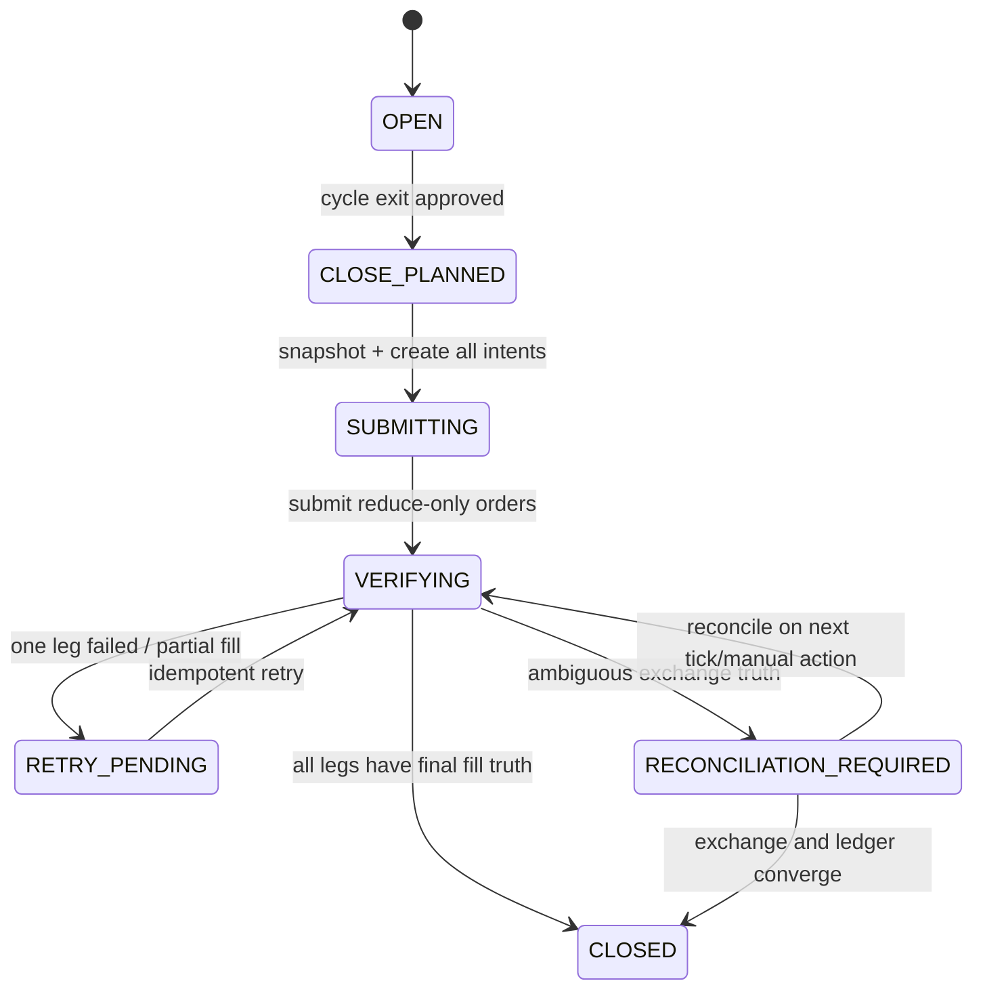

# Kama 彩虹馬丁 M2／H3 回測異常根因與 Cycle 共同平倉修正設計

**作者：Manus AI**  
**日期：2026-08-02**  
**狀態：診斷與設計完成；本輪尚未修改或發布 cycle-close 交易邏輯；未觸發任何實盤送單、撤單或平倉。**

> **核心結論**：本次 `95 → 4` 的 S1 已關閉交易驟減，以及 M2／H3 腿長期殘留，不是 K 棒缺失、CSV 漏列或會計失衡，而是系統一致地執行了錯誤的模式契約。現行 M2 被定義為「雙向完全獨立、逐腿馬丁、逐腿退出」，H3 也以逐腿 close primitive 執行；使用者要求的契約則是「S1 為主腿、M2／H3 為同 cycle 輔助腿，正常終止時按組合損益共同平倉」。兩者在 policy、candidate、kernel、live signal、executor 五層都不相容。[1] [2]

### 版本與發布邊界

專案在本輪稽核開始前，已完成並發布較早的 KRM v2 修復：它解決 S1／M2／H3 角色、cycle 歸屬、M2 入場資格、H3 自動保護、腿級馬丁狀態與報告歸因，但沒有定義「輔助腿必須隨 cycle 共同退出」。本次 9 筆 M2 與 3 筆 H3 正是該既有版本的 durable 回測結果。[12] 本輪新增內容只包括稽核文件、唯讀純記憶體重播腳本與 characterization test；**沒有修改回測或 live 的交易決策／executor，也沒有建立新的 durable Job 或交易所 order intent**。本報告所稱 `krm-cycle-contract-v2` 是下一個待使用者確認的退出契約，不能與先前的角色／入場修復混為同一次發布。

## 一、決策摘要

本次輸入的 M2 回測包含完整 `27,744` 根 M30 K 棒，但只產生 9 筆已關閉交易；其中 S1／PRIMARY 4 筆、M2／INDEPENDENT 5 筆，已實現損益 `-821.76 USDT`，期末仍有 1 條未平倉腿。相同資料、相同 KRM 參數、相同資金與相同終點政策的 S1 基線則有 95 筆已關閉交易。兩者 request snapshot 的差異只在 execution mode／policy，因此根因可以排除策略參數、歷史資料與報表下載層。[1]

| 判定 | 嚴重度 | 結論 |
|---|---|---|
| M2 正常退出語義 | **P0 契約錯誤** | `isolateExitByLeg=true` 與 `OPEN_INDEPENDENT_LEG` 被 canonical normalization 固定，直接違反「輔助腿＋組合共同平倉」。[2] |
| 回測 close primitive | **P0 契約錯誤** | kernel 只按 side 找腿，再逐腿 `closeLeg`；沒有 `CLOSE_CYCLE`、組合 PnL 或同 cycle 擴張。[3] |
| Live close primitive | **P0 實盤風險** | signal 每輪只選一條腿，executor 每次只授權／送出一張單腿 reduce-only 訂單；沒有雙腿提交屏障與失敗補償。[4] [5] |
| H3 orphan hedge | **P0 實盤風險** | PRIMARY 可先關、HEDGE 長期留下；本次 H3 94 個缺席基線 entry 中有 71 個發生在只剩 HEDGE 的期間。[7] |
| H3 回復解除條件 | **P1 parity 錯誤** | live 在主腿回到 `>-觸發門檻` 時可解除，回測要等主腿 `>=0%`；同一 policy 會得到不同持有時間與績效。[3] [4] |
| 15 層／2 倍馬丁可達性 | **P1 配置風險** | 315 次 M2 拒絕全部是既有腿加倉觸及 margin／gross 上限；風控正確拒絕，但 UI 未預先揭示大量配置層不可達。[6] |

**建議決策**是先停止把目前 M2／H3 結果當成可比較的策略績效，保留 S1 作為基線；接著只對 `KAMA_RAINBOW_MARTIN_V1` 導入 `krm-cycle-contract-v2`，不要改寫其他策略的通用 M2／H3 語義。完成 backtest parity、cycle close 與 live mocked failure tests 前，不應啟用 advanced mode 實盤。

## 二、量化根因

### 2.1 M2：交易數減少不是被 315 次「入場拒絕」直接造成

純記憶體重播與 durable Job 完全一致：9 筆交易、315 次 rejected decision、已實現損益 `-821.76 USDT`、期末 1 條未平倉腿。315 次拒絕中，`287` 次為 `RISK_MARGIN_USAGE_LIMIT`、`28` 次為 `RISK_GROSS_NOTIONAL_LIMIT`；候選全部是既有腿加倉（`ADD_SHORT=252`、`ADD_LONG=63`），不是新的 S1 entry。[6]

真正造成 `95 → 4` 的是 cycle 壽命。M2 只建立 5 條 PRIMARY，其中僅 2 條 entry timestamp 與 95 筆基線重合；其餘 **93 個基線入場時點全部落在某條 M2 cycle 仍有 open leg 的期間**。85 個時點仍有 PRIMARY，另外 8 個時點已只剩 M2 輔助腿。最長已結 cycle 佔用 `209.667` 日，期末未結 cycle 已佔用 `179.083` 日。[6]

| M2 cycle | PRIMARY／M2 平倉關係 | 結果 |
|---|---|---|
| Cycle 1 | M2 先關約 40 日 | 非共同平倉 |
| Cycle 2 | M2 先關約 18 日 | 非共同平倉 |
| Cycle 3 | M2 先關 `194.333` 日 | 最大分離 |
| Cycle 4 | PRIMARY 先關約 63 日 | 輔助腿孤立存活 |
| Cycle 5 | M2 已關、PRIMARY 期末仍開 | cycle 未終止 |

4 個同時具有已關閉 PRIMARY 與 M2 的 cycle 中，**共同平倉數為 0**。CSV 每列都以 `KRM_MANAGE_CLOSE` 逐腿退出，證明 `cycleId` 目前只是歸因欄位，不是風控與退出的聚合根。[1]

### 2.2 H3：保護腿長期反客為主

H3 純記憶體重播同樣與 durable Job 完全一致：3 筆已關閉交易、6 次風控拒絕、已實現損益 `-440.16 USDT`、期末 1 條未平倉腿。`7,412` 個 decisions 中有 `7,386` 次 `H3_LOSS_THRESHOLD_NOT_MET`、7 次 `H3_ACTIVE_RATIO_LOCKED`，只建立 2 條 PRIMARY 與 2 條 HEDGE。[7]

兩個 H3 cycle 分別佔用 `189.813` 日與 `387.083` 日；第二個 cycle 期末仍開。95 筆 S1 基線中有 94 個 entry timestamp 未成為 H3 PRIMARY，而且全部發生在已有 open leg 的期間。更關鍵的是，其中 **71 個時點只剩 HEDGE、PRIMARY 已經關閉**。這不是保護主腿，而是 orphan hedge 阻止下一個 S1 cycle。[7]

### 2.3 Characterization test 已固定現況缺口

新增的 characterization test 會在同一 cycle 開啟 PRIMARY 與 INDEPENDENT，接著只送 PRIMARY close。現行 kernel 的結果是只產生 1 筆 PRIMARY trade、INDEPENDENT 仍為 open，decision 為 `CLOSE_ONLY／LEG_SCOPED_CLOSE`。測試檔 `12／12` 通過，代表此錯誤行為可以穩定重現，不是偶發資料問題。[8]

## 三、正確的 KRM v2 業務契約

以下契約只適用於 `KAMA_RAINBOW_MARTIN_V1`；其他策略保留目前通用三模式行為。KRM 應增加獨立版本 `krm-cycle-contract-v2`，並把 cycle 提升為正常風控與退出的聚合根。

| 不變量 | S1 | M2 | H3 |
|---|---|---|---|
| PRIMARY 來源 | 原 KRM S1 entry | 原 KRM S1 entry | 原 KRM S1 entry |
| 輔助腿角色 | 無 | 每 cycle 最多 1 條反向 `M2_AUXILIARY`；儲存層可暫映射既有 `INDEPENDENT` | 每 cycle 最多 1 條反向 `HEDGE` |
| PRIMARY 馬丁 | 原 KRM 規則 | 原 KRM 規則 | 原 KRM 規則 |
| 輔助腿馬丁 | 無 | 可維持腿級獨立狀態，但受專屬 budget 與 cycle 總風控 | **禁止** |
| 正常止盈／trailing | 腿級 | **cycle 組合級** | **PRIMARY 終止時 cycle 級** |
| 硬止損／KILL／清算 | 關單腿 | **關整個 cycle** | **關整個 cycle** |
| H3 恢復解除 | 不適用 | 不適用 | 唯一允許的 HEDGE-only 正常退出；必須使用同一 canonical predicate，且不得留下 PRIMARY 之外的新曝險 |
| 下一個 S1 entry | flat 後允許 | cycle 全部 legs CLOSED 後允許 | cycle 全部 legs CLOSED；或 HEDGE-only recovery 後 PRIMARY 按 S1 繼續 |

> **重要區分**：M2 的馬丁狀態可以按腿隔離，但退出不能按腿隔離。`martinScope=LEG` 與 `normalExitScope=CYCLE` 可以同時成立；現行 policy 把兩者都稱作「完全獨立」，才導致語義混淆。

### 3.1 組合損益的 canonical 公式

正常 M2 組合退出應由**成本後 cycle 淨損益**驅動，而不是任一腿自己的價格變動百分比：

```text
cycleNetPnl
  = Σ(openLegUnrealizedPnl)
  + Σ(cycleRealizedPnl)
  - Σ(openFees + accruedFunding)
  - estimatedCloseFees
  - slippageReserve

cycleReturnPct = cycleNetPnl / cycleGrossFilledCostBasis × 100
```

`cycleGrossFilledCostBasis` 建議定義為 cycle 內仍開放腿的加權成交名義本金總和；不得使用 LONG 與 SHORT 淨額作分母，否則近完全對沖時分母會接近零並產生失真百分比。既有 `trailingActivationPct=3%`、`trailingDrawdownPct=1.5%`、`step=0.5%` 可以映射到 cycle return，但**數值與分母仍應在實作前由使用者確認**，不能把本報告的公式當成獲利保證。

### 3.2 正常退出與緊急退出

正常 M2 management 不再把某條腿的 trailing／TP 直接轉成單腿 close；它只更新 cycle 的 peak return，當組合 trailing 命中時產生一次 `CLOSE_CYCLE`。任何一腿的硬止損、KILL、margin liquidation 或人工「全部平倉」則立即升級成 `EMERGENCY_CLOSE_CYCLE`。這可避免主腿被關後留下反向輔助腿，也能保留安全退出優先權。

H3 可保留一個明確例外：當 PRIMARY 從保護觸發區恢復且已滿足 minimum hold，可依 `HEDGE_ONLY_RECOVERY` 解除 HEDGE，PRIMARY 繼續按 S1 管理。但 PRIMARY 的任何 terminal close 都必須升級成 cycle close；不能再採「先關 HEDGE，等待下一輪再關 PRIMARY」。

## 四、策略隔離的型別與 policy 設計

不應直接把通用 `MultiPositionPolicy` 改成 cycle 模式，因為它目前明確代表可供其他策略使用的「雙向獨立」。建議在 KRM strategy namespace 新增以下合約，由 `normalizeStrategyExecutionPolicy` 只在 KRM key 命中時附加；其他策略與舊快照維持原行為。[2] [9]

```ts
type KrmCycleExitScope = "LEG" | "CYCLE_COMPOSITE";

interface KrmCycleContractV2 {
  contractVersion: "krm-cycle-contract-v2";
  primaryRole: "PRIMARY";
  auxiliaryRole: "NONE" | "M2_AUXILIARY" | "H3_HEDGE";
  martinScope: {
    primary: "LEG";
    auxiliary: "LEG" | "DISABLED";
  };
  normalExitScope: KrmCycleExitScope;
  emergencyExitScope: "CYCLE";
  compositeMetric: "NET_PNL_AFTER_COSTS";
  compositeDenominator: "GROSS_FILLED_COST_BASIS";
  h3RecoveryPolicy?: {
    enabled: boolean;
    recoveryLossThresholdPct: number;
    minimumHoldSeconds: number;
  };
}
```

候選與決策型別應正式加入 `CLOSE_CYCLE` 與多腿目標，而不是繼續把 `closeLegIds` 塞在無型別的 `contextSnapshot`：

```ts
interface CandidateIntent {
  // existing fields...
  action: CandidateIntentAction | "CLOSE_CYCLE";
  cycleIdHint?: string;
  closeScope?: "LEG" | "CYCLE";
}

interface ModeDecision {
  // existing fields...
  targetLegIds?: string[];
  targetCycleId?: string;
  closeScope?: "LEG" | "CYCLE";
}
```

`CLOSE_ALL` 不能取代 `CLOSE_CYCLE`，因為 `CLOSE_ALL` 在現行 kernel 會選中部署內所有 open legs；若未來支援多 cycle，會有越界平倉風險。[3]

## 五、回測 kernel 修正

回測不需要模擬交易所的雙單原子性，但必須保證同一 bar、同一決策、同一 cycle 的 deterministic close。建議新增 `evaluateCycleClose` 與 `applyCycleCloseCandidate`，並將 KRM terminal close 在 adapter 層升級為 `CLOSE_CYCLE`。

```text
FORCED_LIQUIDATION
  → EMERGENCY_CYCLE_CLOSE
  → NORMAL_COMPOSITE_CYCLE_CLOSE
  → H3_RECOVERY_UNWIND
  → ADD / NEW EXPOSURE
```

在同一根 K 棒上，cycle close 一旦核准，該 cycle 後續 ADD／OPEN candidates 必須記為 `HOLD／EVENT_INVALIDATED_BY_CYCLE_CLOSE`。兩條腿各自保留一筆 trade 以維持逐腿損益可追溯，但必須共享 `cycleCloseId`、`exitTime`、`exitPriceSource` 與 `cycleExitReason`。最終報表另增加 cycle summary，顯示組合淨損益、費用、funding、峰值回報與退出門檻。

回測 H3 recovery predicate 必須與 live 共用同一 pure function，例如：

```ts
shouldUnwindHedgeOnRecovery({
  primaryLossPct,
  recoveryLossThresholdPct,
  heldMs,
  minimumHoldMs,
})
```

目前回測以 `primaryPnl >= 0%` 判定，live 則以 `primaryLossPct > -primaryLossTriggerPct` 判定；兩者不可繼續各寫一套。[3] [4]

## 六、Live：協調式共同平倉 Saga

交易所無法提供跨 LONG／SHORT 兩張委託的真正資料庫式原子交易，因此正確目標是**協調式共同平倉、可重試、可對帳、失敗時 fail closed**，而不是宣稱絕對同時成交。



建議流程如下：

1. 以 cycle lock 鎖定 PRIMARY 與輔助腿，拒絕該 cycle 的新 ADD／OPEN。
2. 讀取 ledger legs 與交易所 LONG／SHORT positions，驗證 ownership、數量與 position mode；任何差異立即進入 `RECONCILIATION_REQUIRED`，不得猜測。
3. 建立一筆 immutable `CYCLE_CLOSE_APPROVED` decision，內容包含 cycleId、兩條 legId、各自數量、組合損益快照、原因與 policy version。
4. 在同一資料庫 transaction 預建每條腿各一筆 reduce-only order intent，兩者共用 decisionId，且 idempotency key 為 `strategyId:cycleId:closeCommandId:legId`。
5. 兩張 market reduce-only 單以 `Promise.allSettled` 近同時提交；`clientOrderId` 必須由 closeCommandId＋legId deterministic 產生，不能繼續使用 `Date.now()`。[5]
6. 逐單取得 final fill truth。若一張已成交而另一張失敗，已成交腿不可回補開倉；系統應只重試剩餘 reduce-only close，並禁止該策略新增曝險。
7. 只有在所有 legs 都確認為 0、fills 與 trades 已落帳後，才把 cycle 標記 CLOSED、關閉 hedge relationship 並釋放 bar locks。
8. 若成交真相不明，cycle 與未決 legs 標成 `RECONCILIATION_REQUIRED`，由下一次策略 tick 或人工對帳續作；不得依賴 Autoscale 容器內常駐 background process。

現有 `execution_order_intents` 已有唯一 `idempotencyKey`、狀態轉移與 row lock，可復用為每腿 intent；`position_cycles`、`position_legs`、`hedge_relationships` 亦已具備 cycleId 關聯。[5] [10] [11] 為了 crash recovery 與操作可視性，仍建議新增 `cycle_close_commands` 主檔，而不是只靠查詢同 decisionId 的多筆 intents 推導 command 狀態。

| `cycle_close_commands` 欄位 | 用途 |
|---|---|
| `closeCommandId` unique | 重試與 clientOrderId 的穩定根識別 |
| `strategyId`、`cycleId`、`decisionId` | ownership 與稽核 |
| `status` | `PLANNED／SUBMITTING／VERIFYING／RETRY_PENDING／CLOSED／RECONCILIATION_REQUIRED` |
| `targetLegSnapshot` JSON | 提交前腿、數量、side、role 不可變快照 |
| `cyclePnlSnapshot` JSON | 組合觸發證據 |
| `reasonCode`、`policyVersion` | 可解釋性與版本追蹤 |
| `attemptCount`、`lastError` | 有界重試與營運診斷 |
| `createdAt`、`updatedAt`、`closedAt` | 生命週期 |

## 七、風控與配置可達性

本次 315 次拒絕證明 portfolio risk gate 有作用，但目前 UI 允許顯示 15 層、2 倍馬丁，而 `10,000 USDT` 資金與 `maxGrossNotionalPct=100%` 不可能支持理論總名義 `6,553,500 USDT`。系統不應等到回測中產生數百次拒絕才讓使用者發現。[1] [6]

建議在保存快照與啟動回測前計算 `effectiveReachableLayer`，同時顯示 portfolio cap、主腿 reserve 與輔助腿 cap。M2 輔助腿不得吃掉 PRIMARY 下一個必要加倉的預留額度；H3 則繼續由 `hedgeRatio／maxHedgeRatio` 限制，且禁止馬丁。若使用者仍保存不可達配置，可以允許但必須顯示明確 warning，並把預估拒絕原因寫入 immutable request snapshot。

## 八、驗收矩陣

以下測試是修正完成的必要條件；績效變好不是 correctness gate，因為共同平倉可能改善或惡化特定樣本，不能以獲利結果取代契約驗證。

| ID | 測試 | 必須結果 |
|---|---|---|
| A1 | S1 同參數完整重跑 | 維持 95 筆基線與既有 accounting；advanced 修改不得改動 S1 |
| A2 | M2／H3 trigger 永不命中的 fixture | PRIMARY entries、adds、exits 與 S1 bit-for-bit parity |
| A3 | M2 同 cycle PRIMARY＋AUXILIARY，PRIMARY normal close | 轉成一個 `CLOSE_CYCLE`；兩腿同 bar 關閉 |
| A4 | M2 輔助腿單獨 normal trailing 命中但組合未達標 | 不得單腿關閉；只更新 cycle 組合狀態 |
| A5 | M2 組合 trailing 命中 | 兩筆 leg trades 共用 cycleCloseId／exitTime；無 orphan leg |
| A6 | 任一腿 hard stop／KILL | 整個 cycle emergency close；同 bar 後續 ADD 被 invalidated |
| A7 | H3 PRIMARY terminal close 且 HEDGE 存在 | 一個 cycle-close command 包含兩腿；不得 hedge-first 後等待下一輪 |
| A8 | H3 recovery unwind | 只關 HEDGE；回測與 live pure predicate 完全相同；PRIMARY 繼續 |
| A9 | H3 orphan hedge 輸入 | 禁止新增曝險；直接進入 close／reconciliation 流程 |
| A10 | Live 第一腿成交、第二腿 rejected | command 為 RETRY_PENDING／RECONCILIATION_REQUIRED；無回補開倉、無新 entry |
| A11 | Live 重送同一 close command | deterministic clientOrderId 與 intent key 去重；不重複下單、不重複 trade |
| A12 | Partial fill | 只對剩餘數量重試 reduce-only；ledger 與交易所數量收斂 |
| A13 | Backtest force_close | 同 cycle 所有 open legs 同終點 timestamp 關閉 |
| A14 | Backtest mark_to_market | 保留 open cycle，已實現＋未實現＋費用對帳平衡 |
| A15 | 15 層／2 倍不可達配置 | UI／preflight 顯示 effective layer 與 budget warning，不產生誤導 |
| A16 | 原有 generic M2／H3 與其他策略測試 | 全部不變，證明 KRM 策略隔離 |

### 歷史資料重跑驗收

修正後應使用同一組 `27,744` 根 K 棒與 immutable canonical snapshot 執行 S1、M2、H3。必須比較 entry timeline、cycle timeline、共同平倉率、orphan duration、reason-code 分布、realized／unrealized PnL、turnover、fees、funding 與會計 reconciliation。M2 的共同平倉率應為 100%（排除期末 mark-to-market open cycle）；H3 在 PRIMARY terminal close 時應為 100%，HEDGE-only recovery 需另列，不能混入 terminal cycle close 指標。

不應把「M2 必須仍有 95 筆 PRIMARY」設為硬性 gate，因為真正的輔助腿會改變 cycle 退出時間；正確 gate 是：沒有 advanced trigger 時與 S1 完全一致、advanced leg 開啟前 PRIMARY 路徑一致、每個完成 cycle 沒有 orphan 輔助腿、所有差異都有可追溯的 cycle decision。

## 九、實作順序與發布閘門

| 階段 | 修改範圍 | 發布條件 |
|---|---|---|
| 0. 契約凍結 | 確認 composite 分母、M2 輔助腿 budget、H3 recovery 門檻 | 使用者確認數值；不改 live |
| 1. Pure domain | KRM v2 policy、cycle PnL、recovery predicate、state reducer | 純函式 tests 全通過 |
| 2. Backtest | adapter 產生 CLOSE_CYCLE、kernel atomic-in-bar close、報表 cycle summary | A1–A9、A13–A16 通過；歷史 parity 對帳 |
| 3. Live persistence | cycle_close_commands migration、typed decision、deterministic intents | migration 與 ledger tests 通過 |
| 4. Live executor | saga、近同時提交、部分成交／失敗補償、reconciliation | 僅 mock adapter；A10–A12 通過 |
| 5. Shadow／paper | 不送真單或交易所 demo 環境；比對 signal 與 cycle command | 零 orphan、零重複 intent、零未解 reconciliation |
| 6. 受控啟用 | 單部署、低限額、預設 disabled、人工 enable | 明確使用者批准後才可進入實盤 |

每個階段都必須保留 feature flag 與舊 policy version。已存在 open legs 的 deployment 不得原地切換 v2；應先 drain／flat，再更新 policy snapshot。若出現 unresolved reconciliation，feature flag rollback 只能阻止新曝險，不能刪除成交真相或把實際持倉當作不存在。

## 十、結論

目前 M2／H3 的會計是平衡的，但業務語義錯誤：系統把依附 S1 的輔助腿當成可獨立結束的腿，再以「任一 open leg 即佔用 cycle」阻止後續 PRIMARY。這同時解釋了零共同平倉、M2 最大 `194.333` 日平倉差、M2 93 個基線 entry 落在既有 cycle、H3 71 個 entry 落在 orphan-hedge 期間，以及 `95 → 4／2` 的交易數壓縮。[1] [6] [7]

最小但完整的修正不是調整一個參數，而是導入 **KRM 專屬 cycle contract v2、typed `CLOSE_CYCLE`、回測同 bar 共同關閉、live 可重試 saga、H3 canonical recovery predicate 與配置可達性 preflight**。在上述驗收通過之前，advanced 結果只能作為舊錯誤契約的診斷樣本，不宜用來評估策略優劣，也不應進入實盤。

## References

[1]: ./krm-three-mode-redesign-evidence.md "KRM 三模式稽核證據底稿"
[2]: ../shared/executionModes.ts "通用三模式 canonical execution policy"
[3]: ../server/services/backtest/threeModePortfolioKernel.ts "三模式回測 portfolio kernel"
[4]: ../server/services/kamaRainbowMartinAdvancedSignal.ts "KRM live advanced signal"
[5]: ../server/services/kamaRainbowMartinAdvancedExecutor.ts "KRM live advanced executor"
[6]: ./krm-m2-inmemory-root-cause.json "M2 純記憶體 parity 與 root-cause JSON"
[7]: ./krm-h3-inmemory-root-cause.json "H3 純記憶體 parity 與 root-cause JSON"
[8]: ../server/services/backtest/threeModePortfolioKernel.test.ts "Kernel characterization 與 accounting tests"
[9]: ../shared/strategies/kamaRainbowMartinExecutionPolicy.ts "KRM strategy-specific policy override"
[10]: ../server/services/threeModeLedger.ts "三模式 ledger 與 order intent idempotency"
[11]: ../drizzle/schema.ts "Position cycle、leg、relationship、decision 與 intent schema"
[12]: ./krm-three-mode-final-validation-report.md "先前 KRM v2 入場、角色、報告與 durable 回測驗證報告"
